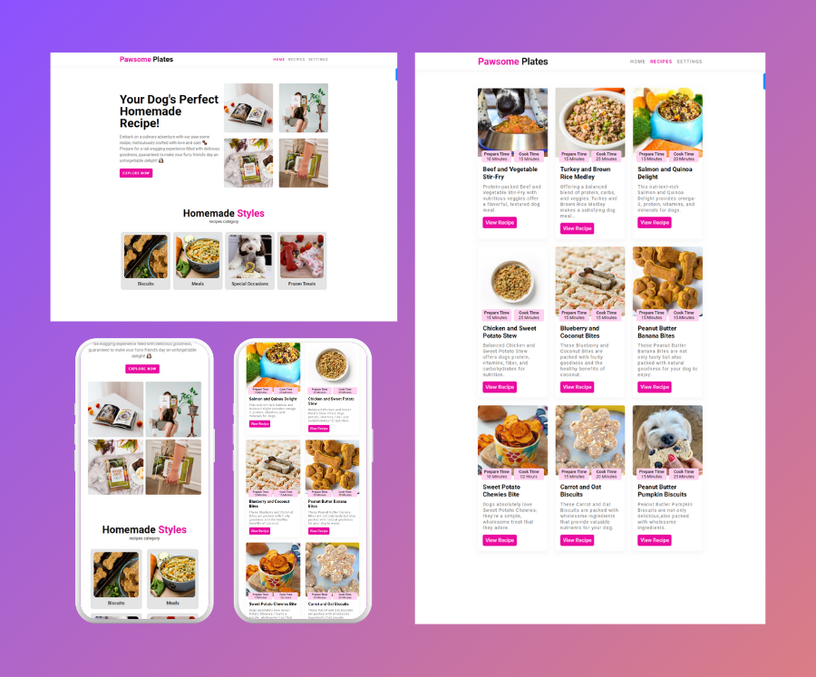

# Pawsome Plates - Dog food Recipes WebApp
A Dog Mom's Guide to Healthy and Delicious Homemade Dog Food"! This book is designed especially for dog moms like you who want to provide their furry companions with nutritious and tasty meals made with love.

    
    
    
    
    

## Table-of-Contents
* [Links](#Links)
* [Mock-Up](#Mock-Up)
* [License](#License)
* [Contributing](#contributing)
* [FAQs](#faqs)
  
## 🚀 [Links](#table-of-contents)

Deployed URL: https://vimukthigunasekara.github.io/pawsome-plates/
 
GitHub Repo URL: https://github.com/VimukthiGunasekara/pawsome-plates

## 📺 [Mock-Up](#table-of-contents)

         
## 📑 [License](#table-of-contents)

Your repository is licensed under an mit open source license, so other people can contribute more easily.More information can be found by clicking this [link.](https://choosealicense.com/licenses/mit)

## 🤝 [Contributing](#table-of-contents)
We are open to all kinds of contributions. If you want to:
* 🤔 Suggest a feature
* 🐛 Report an issue
* 📖 Improve documentation
* 👨‍💻 Contribute to the code

We are excited that you are reading this and are willing to contribute. No need to think big. Even a typo fix might save our day and make you a hero. Every contribution counts!
     
Feel free to check [issues page](https://github.com/VimukthiGunasekara/pawsome-plates/issues) 
     
## 🤔 [FAQs](#table-of-contents)
Please contact me using the following links:

[GitHub](https://github.com/VimukthiGunasekara) / Email: vimukthisadaruwan65@gmail.com
